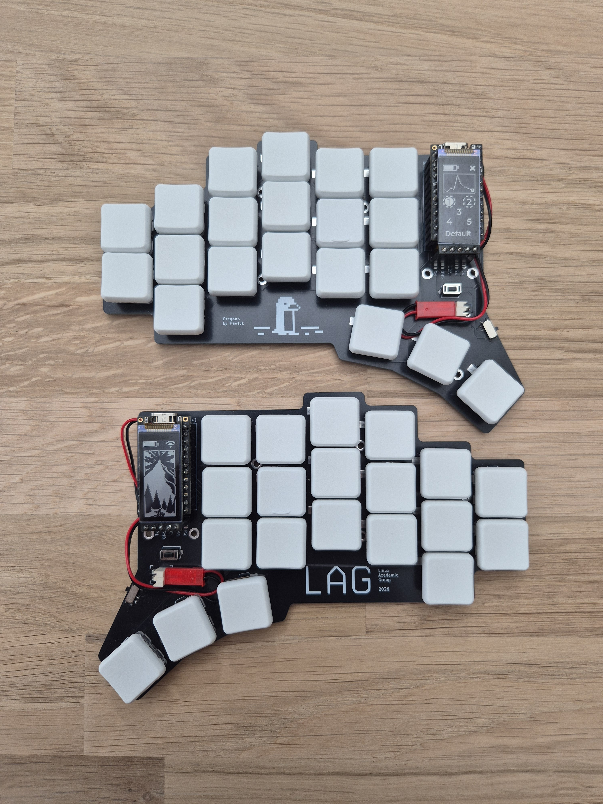
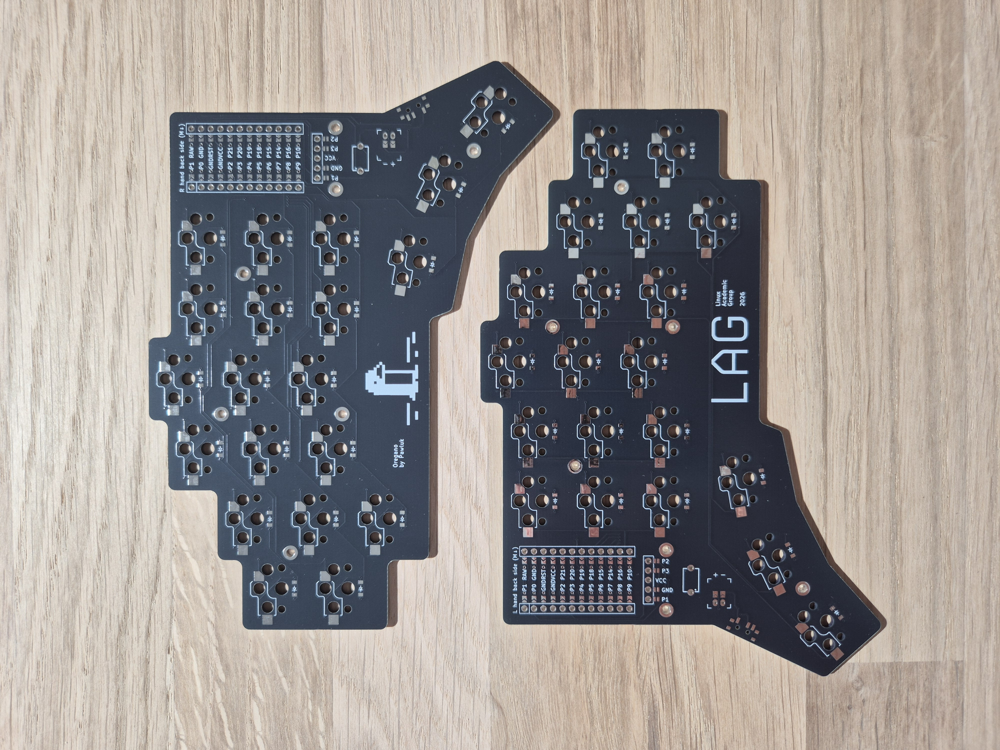
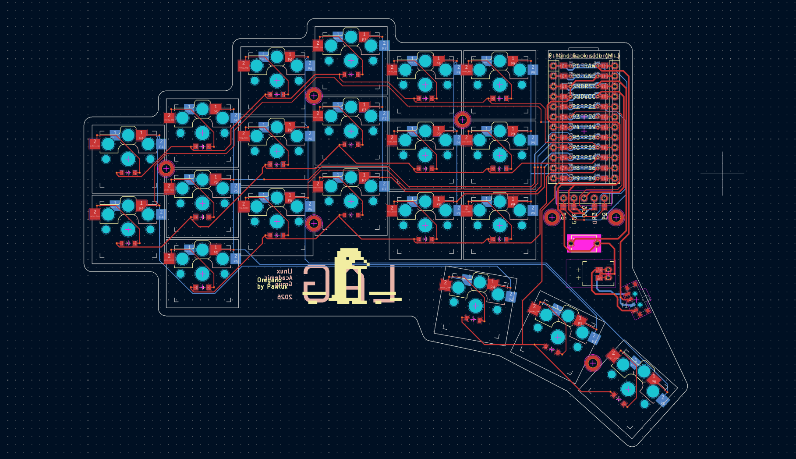

# Oregano

[(Upstream repo)](https://github.com/pwlsp/oreganokb)

This is my first custom mechanical keyboard.
It's a wireless split keyboard with Choc v1 switches.
The MCU is a Pro Micro / Nice!Nano alternative.
The Display is a Nice!View compatible alternative (5 pins).
The PCB is reversible and I put some mounting holes on it, but didn't use them this time.

