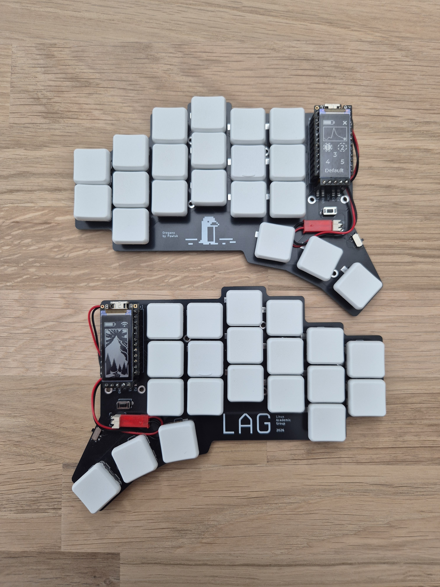
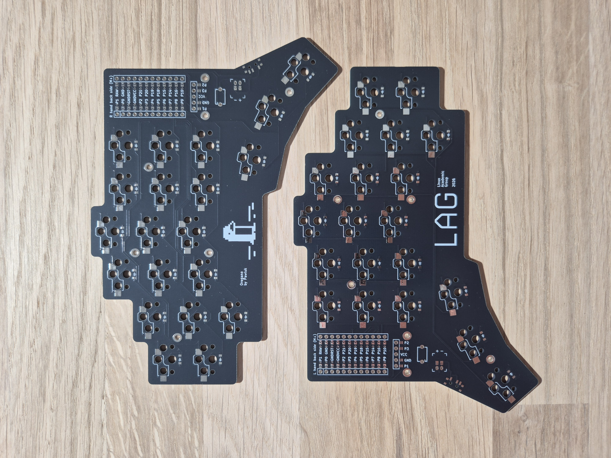
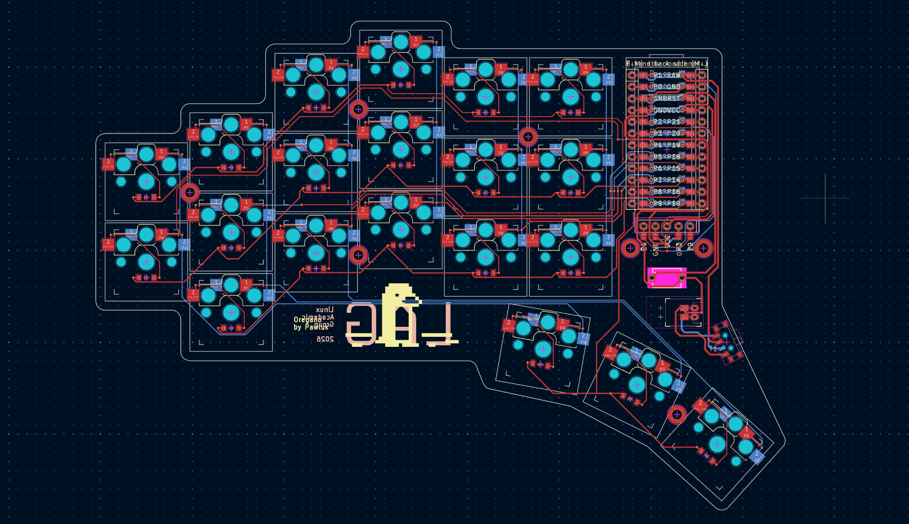

# Oregano

[(Upstream repo)](https://github.com/pwlsp/oreganokb)

This is my first custom mechanical keyboard.
It's a wireless split keyboard with Choc v1 switches.
The MCU is a Pro Micro / Nice!Nano alternative.
The Display is a Nice!View compatible alternative (5 pins).
The PCB is reversible and I put some mounting holes on it, but didn't use them this time.

Thanks [KiCad](https://www.kicad.org),
[ZMK](https://zmk.dev/),
[Ergogen](https://github.com/ergogen/ergogen),
[FlatFootFox](https://flatfootfox.com/ergogen-introduction/),
[Christian Selig](https://youtu.be/7UXsD7nSfDY?si=RpAxVBA9T7kh9S_W),
[Joe Scotto](https://youtu.be/l5kAx08Iom4?si=qxbWYizypEf4wrtC),
[LAG](https://github.com/Linux-Academic-Group)
.

